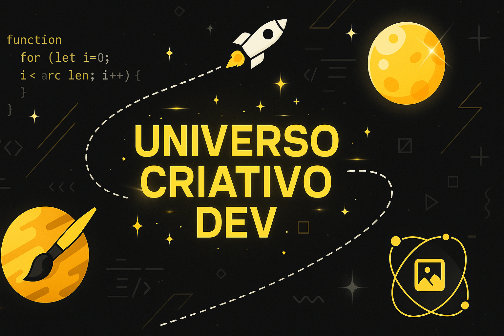

# 🌌 Universo Criativo Dev - Portfólio Pessoal



Bem-vindo ao meu portfólio! Este projeto foi criado para apresentar minha trajetória como desenvolvedora, designer e criadora de conteúdo — unindo programação, design criativo e ilustração em um só lugar. ✨

---

## 🎯 Objetivo

Este portfólio tem como propósito:

- Exibir meus **projetos de desenvolvimento web**
- Apresentar meu lado **criativo e visual** com ilustrações e thumbnails
- Demonstrar domínio em **tecnologias modernas**, com foco na experiência do usuário (UX) e interface (UI)
- Servir como vitrine profissional para oportunidades em **empresas de tecnologia e design**

---

## 🧩 Seções do Portfólio

### 🧭 Navbar Animada  
Logo animado com tema espacial (SVG/Lottie), navegação suave entre seções e adaptação para dispositivos móveis.

### 🚀 Hero  
Mensagem de boas-vindas com animação de digitação e efeitos de brilho.

### 💡 Projetos  
Carrossel com miniaturas dos projetos. Ao clicar, abre-se um **modal elegante** com prints em alta qualidade, informações, tecnologias utilizadas e link para o GitHub.

### 🛠 Tecnologias Utilizadas  
Marquee animado com ícones das stacks empregadas em cada projeto: HTML, CSS, JS, Tailwind, entre outras.

### 🧪 Laboratório Criativo  
Galeria com meus trabalhos visuais: ilustrações, thumbnails e logotipos.

### 👩‍🚀 Mais sobre mim  
Texto de apresentação com um toque criativo, misturado ao mascote do site e à estética do universo.

### 📬 Contato  
Mascote + links para entrar em contato.

---

## 🛠 Tecnologias e Ferramentas

- **HTML5**, **CSS3**, **JavaScript**
- **Tailwind CSS**
- **SwiperJS** (carrossel dos projetos)
- **Lightbox / Modal customizado**
- **SVG + Lottie** para animações
- **GitHub Pages** para hospedagem

---

## 📁 Estrutura de Pastas

```
├── 📁 assets/                        
│   ├── 📁 css/                      # Arquivos CSS separados por seção ou estilos gerais
│   ├── 📁 data/                     # Dados dinâmicos, como JSON
│   ├── 📁 docs/                     # Documentação extra, se houver
│   ├── 📁 icons/                    # Ícones usados no projeto
│   ├── 📁 img/                      # Imagens gerais
│   │   └── 📁 galeria/              # Galeria de imagens dos projetos
│   │       ├── 📁 projeto-adote-pet/
│   │       ├── 📁 projeto-clinica-odontologica/
│   │       ├── 📁 projeto-motoxtreme/
│   │       ├── 📁 projeto-mypetshow/
│   │       └── 📁 projeto-reconhecimento-facial/
│   └── 📁 js/                       # Scripts JS organizados por funcionalidades
│
├── 📁 partials/                     # Sections carregadas dinamicamente no index.html
│                                 # (ex: seções como "Sobre mim", "Contato", "Laboratório Criativo")
│
├── 📁 projetos/                     # Layouts dos cards e modais dos projetos
│                                 # Carregados dinamicamente pelo partial projetos.html
│
├── index.html                    # Página principal do portfólio, que carrega os partials
└── README.md                     # Documentação principal do projeto

```

---

## 🔧 Como Rodar Localmente

1. Clone o repositório:
   ```bash
   git clone https://github.com/angelluzk/meu_portfolio.git
   ```

2. Acesse a pasta:
   ```bash
   cd meu_portfolio
   ```

3. Abra o arquivo `index.html` no navegador.

> ✅ Não é necessário backend ou dependências adicionais. É um projeto 100% front-end.

---

## 🌐 Hospedagem

O portfólio está disponível online em:  
📍 [https://angelluzk.github.io/meu_portfolio](https://angelluzk.github.io/meu_portfolio)

---

## 💛 Agradecimentos

A todas as inspirações visuais e tutoriais que me ajudaram a compor este universo criativo. E, claro, aos visitantes que dedicam um tempo para conhecer meu trabalho.

---

## 📩 Contato

Se quiser conversar, colaborar ou oferecer uma oportunidade:

📬 E-mail: [contatoangelluz@gmail.com](mailto:contatoangelluz@gmail.com)  
🐙 GitHub: [@angelluzk](https://github.com/angelluzk)  
💼 LinkedIn: [linkedin.com/in/angelitaluz](https://www.linkedin.com/in/angelitaluz/)

---

> Desenvolvido com 💛 por Angel Luz – Universo Criativo Dev